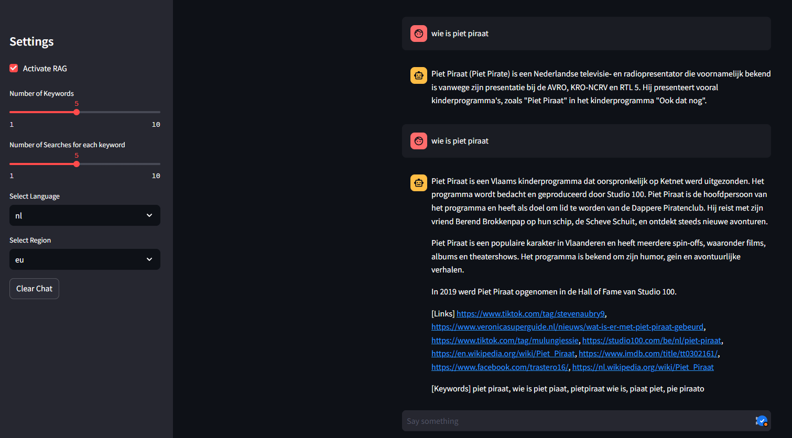

**DIY-RAG**
================

**Retrieval-Augmented Generation (RAG) with a LLM keyword extractor to a Google search query to prevent hallucinations.**

**Introduction**
---------------

DIY-RAG is an open-source implementation of the Retrieval-Augmented Generation (RAG) framework, designed to prevent hallucinations in text generation tasks. By leveraging a Large Language Model (LLM) keyword extractor and a Google search query, DIY-RAG provides a robust solution for generating high-quality text while minimizing the risk of hallucinations.

**Features**
------------

* **Retrieval-Augmented Generation (RAG)**: Our implementation uses RAG to retrieve relevant information from a large corpus of text, which is then used to augment the generated text.
* **LLM Keyword Extractor**: We utilize a Large Language Model (LLM) to extract keywords from the input text, which are then used as a search query on Google to retrieve additional information.
* **Google Search Query Integration**: Our system uses the extracted keywords to construct a Google search query, which is then used to retrieve relevant information from the web.

* ### Installation Steps

1. Clone the repository using Git:
```bash
git clone "link"
```
2. Install the required libraries using pip:

3. Set up the LM studio server to port 9999
  
4. Run the DIY-RAG streamlit app using the `main.py` file:
```bash
streamlit run .\main.py
```
**Example**
The first prompt was without the RAG activated, leading to a wrong result or a hallucination. The second prompt was with the RAG activated resulting in a correct answer!



***To Do**
Try with function calling ...
